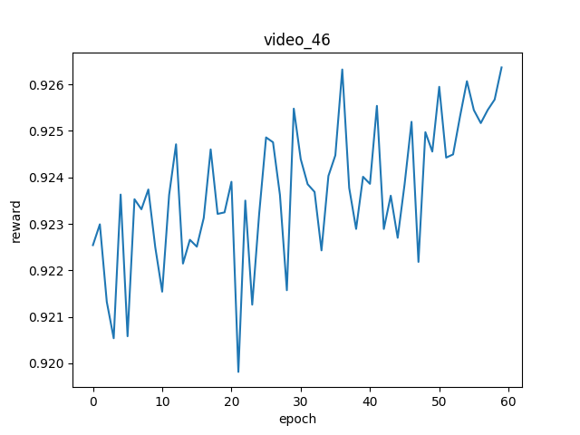

# Deep Reinforcement Learning for Unsupervised Video Summarization with Diversity-Representativeness Reward.

### INTRODUCTION
This is the final project for the Artificial Intelligence course (CS106.P21), carried out by the group camonvidaden under the supervision of PhD. Luong Ngoc Hoang.

#### MEMBER
|#|Full Name|Student ID|
|:-:|:-:|:-:|
|1|[Nguyễn Thắng Lợi](https://github.com/NT-Loi)|23520872|
|2|[Trần Tuấn Kiệt](https://github.com/trtkiet)|23520822|
|3|[Nguyễn Mỹ Thống](https://github.com/iknizzz1807)|23521527|
|4|[Phạm Tài Lộc]()|23520865|
## Get started
1. Download preprocessed datasets [google drive link](https://drive.google.com/open?id=1Bf0beMN_ieiM3JpprghaoOwQe9QJIyAN).

2. Make splits
```bash
python create_split.py -d datasets/eccv16_dataset_summe_google_pool5.h5 --save-dir datasets --save-name summe_splits  --num-splits 5
```
As a result, the dataset is randomly split for 5 times, which are saved as json file.

Train and test codes are written in `main.py`. To see the detailed arguments, please do `python main.py -h`.

## How to train
```bash
python main.py -d datasets/eccv16_dataset_summe_google_pool5.h5 -s datasets/summe_splits.json -m summe --gpu 0 --save-dir log/summe-split0 --split-id 0 --verbose
```

## How to test
```bash
python main.py -d datasets/eccv16_dataset_summe_google_pool5.h5 -s datasets/summe_splits.json -m summe --gpu 0 --save-dir log/summe-split0 --split-id 0 --evaluate --resume path_to_your_model.pth.tar --verbose --save-results
```

If argument `--save-results` is enabled, output results will be saved to `results.h5` under the same folder specified by `--save-dir`. To visualize the score-vs-gtscore, simple do
```bash
python visualize_results.py -p path_to/result.h5
```

## Plot
We provide codes to plot the rewards obtained at each epoch. Use `parse_log.py` to plot the average rewards
```bash
python parse_log.py -p path_to/log_train.txt
```
The plotted image would look like
<div align="center">
  
</div>

If you wanna plot the epoch-reward curve for some specific videos, do
```bash
python parse_json.py -p path_to/rewards.json -i 0
```

You will obtain images like
<div align="center">
  
  
  
</div>

If you prefer to visualize the epoch-reward curve for all training videos, try `parse_json.sh`. Modify the code according to your purpose.

## Visualize summary
You can use `summary2video.py` to transform the binary `machine_summary` to real summary video. You need to have a directory containing video frames. The code will automatically write summary frames to a video where the frame rate can be controlled. Use the following command to generate a `.mp4` video
```bash
python summary2video.py -p path_to/result.h5 -d path_to/video_frames -i 0 --fps 30 --save-dir log --save-name summary.mp4
```
Please remember to specify the naming format of your video frames on this [line](https://github.com/KaiyangZhou/pytorch-vsumm-reinforce/blob/master/summary2video.py#L22).

## How to use your own data
We preprocess data by extracting image features for videos and save them to `h5` file. The file format looks like [this](https://github.com/KaiyangZhou/vsumm-reinforce/issues/1#issuecomment-363492711). After that, you can make split via `create_split.py`. If you wanna train policy network using the entire dataset, just do `train_keys = dataset.keys()`. [Here](https://github.com/KaiyangZhou/pytorch-vsumm-reinforce/blob/master/main.py#L75) is the code where we initialize dataset. If you have any problems, feel free to contact me by email or raise an `issue`.
